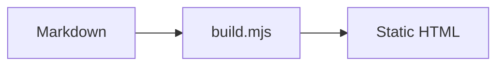

# raghib.io

A deliberately plain personal site: markdown in, static HTML out. No
framework, no bundler, no client-side router. One stylesheet, one small
module of vanilla JavaScript, and a build script you can read in a sitting.

Supports **text**, **diagrams** (Mermaid + Excalidraw) and **dark mode**.

## Quick Start

```bash
bun install       # or npm install — the only build dependency is `marked`
bun dev           # build + serve on http://localhost:3000, rebuilds on save
bun run build     # one-off build into dist/
```

`dist/` is a folder of static files. Any static host will serve it as-is.

## Layout

```
build.mjs              the entire site generator (~400 lines of plain Node)
site/
  content/
    home.md            homepage intro copy
    posts/*.md         writing, sorted newest first
    pages/*.md         standalone pages (about, etc.)
  assets/
    style.css          the whole design system
    app.js             theme toggle, scroll spy, diagram rendering
    diagrams/          Excalidraw exports
dist/                  generated output (gitignored)
```

## Writing a Post

Drop a markdown file into `site/content/posts/`:

```markdown
---
title: "A New Post"
description: "One line that shows up in the index and the feed"
date: "2026-08-06"
tags: ["notes"]
published: true
---

## First Section

Body text. Every `##` heading becomes a numbered PART in the left
sidebar, and the sidebar tracks your position as you scroll.
```

Set `published: false` to keep a draft out of the build.

### Extras

- `==highlighted text==` renders as a yellow marker pass
- Standard GFM: tables, task lists, strikethrough
- Code blocks are labelled with their language and intentionally not
  syntax-highlighted — the page is monospace throughout

## Diagrams

### Mermaid — diagrams you type

Tag a fenced code block with `mermaid` and it renders client-side:

````markdown

````

The renderer is loaded **only on pages that contain a diagram**, and it
re-renders when the theme changes. The Mermaid module is pulled from a CDN;
change `MERMAID_URL` at the top of `site/assets/app.js` to self-host it.

### Excalidraw — diagrams you draw

1. Draw at [excalidraw.com](https://excalidraw.com)
2. **File → Export image → SVG**, with *Embed scene* ticked so the file
   stays editable when you drag it back into Excalidraw later
3. Save it into `site/assets/diagrams/` and reference it:

```markdown

```

For dark mode, export the same drawing a second time with Excalidraw's dark
theme on and save it beside the first with a `.dark.svg` suffix:

```
site/assets/diagrams/
  pipeline.svg        used in light mode
  pipeline.dark.svg   used in dark mode
```

The build detects the sibling automatically and lets CSS pick between them —
no JavaScript, no flash, no filter hacks. Without a dark variant, the single
image is used in both themes.

## Dark Mode

Follows `prefers-color-scheme` until the visitor clicks the toggle, after
which the choice is remembered in `localStorage`. The theme is applied by a
tiny inline script in `<head>`, so there is no flash of the wrong theme.

Colours live in one place — the `:root` and `[data-theme='dark']` blocks at
the top of `site/assets/style.css`.

## Progressive Enhancement

The site is fully readable with JavaScript disabled. Without it you lose the
theme toggle, the sidebar scroll-spy highlight, and Mermaid rendering
(diagram source is shown instead). Nothing else.

---

## Legacy Next.js App

The previous Next.js version of this site still lives in `src/` and is no
longer wired into `bun dev` / `bun run build` — use `bun run next:dev` and
`bun run next:build` for it. It is kept because the Apple Health automation
(`/health`, `scripts/`, and the `gh-aw` workflows in `.github/workflows/`)
writes into `src/data/steps.json`. Delete `src/` only after porting or
retiring that pipeline.

The health setup is documented in [`docs/getting-started.md`](docs/getting-started.md),
with privacy invariants in [`docs/security-model.md`](docs/security-model.md).

## License

MIT — see [LICENSE](LICENSE).
