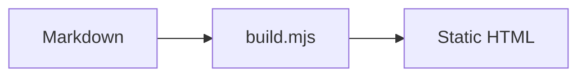
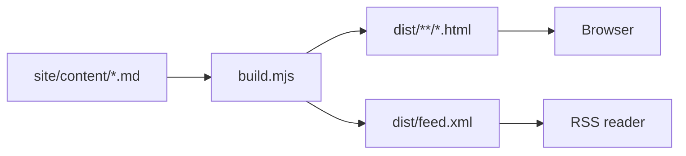
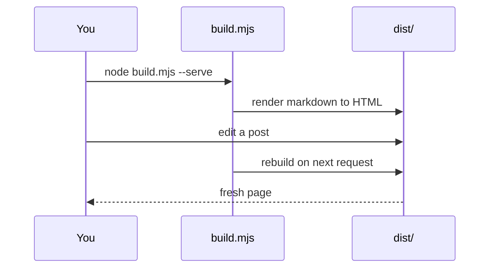

Most of what I want to explain is text. Occasionally a picture does the work
of three paragraphs, and for those cases this site supports two kinds of
diagram — one written, one drawn.

## Mermaid, For Diagrams You Type

A fenced code block tagged `mermaid` becomes a rendered chart. The source
lives in the markdown file, in version control, diffable like any other
line of text.

````

````

Which renders as:



Sequence diagrams work too, and so does everything else Mermaid supports —
state charts, ER diagrams, Gantt, pie, timelines.



The renderer is loaded ==only on pages that actually contain a diagram==,
and it is re-themed the instant you flip between light and dark. Try the
toggle in the top right and watch the boxes above follow.

## Excalidraw, For Diagrams You Draw

Mermaid is excellent at structure and bad at feeling. When a sketch needs
to look like it was drawn by a human — architecture napkin drawings,
annotated screenshots, anything with an arrow that means *"roughly here"* —
I use [Excalidraw](https://excalidraw.com) instead.

The workflow is three steps:

1. Draw it at [excalidraw.com](https://excalidraw.com)
2. **File → Export image → SVG**, with *Embed scene* ticked so the file
   stays editable when you drag it back in later
3. Save it into `site/assets/diagrams/` and reference it from markdown

```markdown

```


### Dark Mode For Drawings

An SVG exported on a white canvas looks wrong on a dark page, and inverting
it with a CSS filter mangles the colours. So the build does something
simpler: export the same drawing twice — once normally, once with
Excalidraw's dark theme enabled — and save the second next to the first
with a `.dark.svg` suffix.

```
site/assets/diagrams/
  pipeline.svg        used in light mode
  pipeline.dark.svg   used in dark mode
```

The build script notices the sibling file and emits both images, letting
CSS pick. No JavaScript involved, no flash, no filter hacks. If there is no
dark variant, the single image is used in both themes.

## Which One To Reach For

| | Mermaid | Excalidraw |
|---|---|---|
| Authored in | Markdown | The browser |
| Diffs well | Yes | Not really |
| Feels | Precise | Human |
| Good for | Flows, sequences, state | Sketches, annotations |
| Cost | Renders client-side | Just an image |

> **NOTE** — If a diagram is load-bearing for understanding, write it in
> Mermaid so it stays in sync with the prose. If it's atmosphere, draw it.

## The Rest Of The Toolkit

A few other things this site quietly supports, since they cost almost
nothing:

- `==highlighted text==` renders as ==a yellow marker pass==
- Every `##` heading becomes a numbered part in the left sidebar, and the
  sidebar tracks where you are as you scroll
- Code blocks are labelled with their language and left unhighlighted on
  purpose — the page is monospace throughout, so syntax colour is noise
- The whole thing is readable with JavaScript switched off
